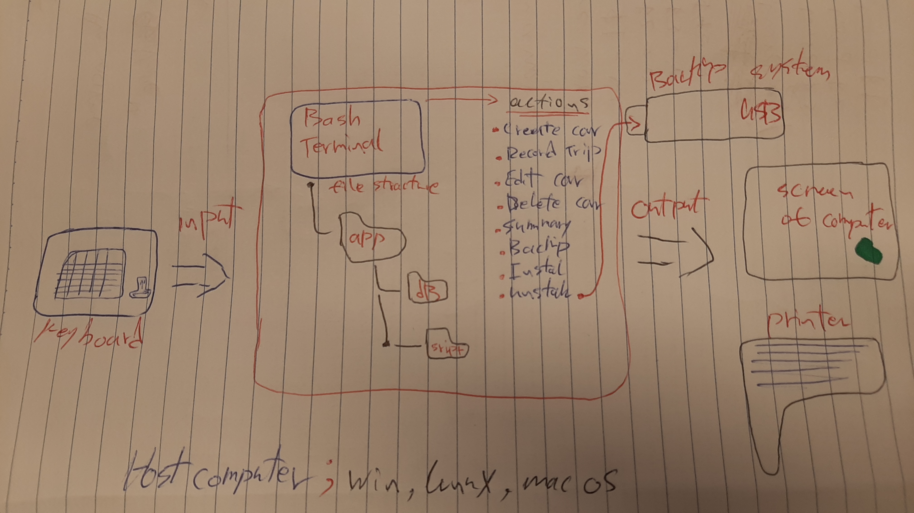
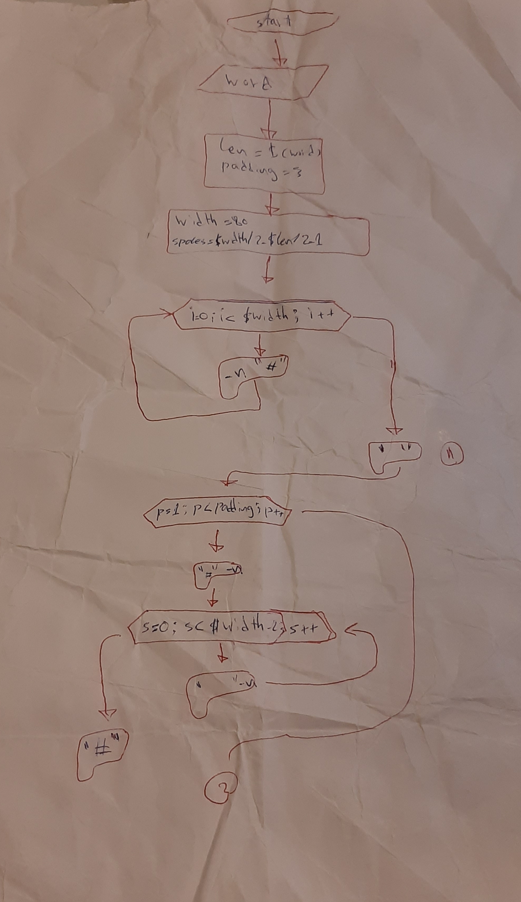

Car Rental Minimal App
===========================

A car rental management minimal app in Bash.

Contents
-----
  1. [Planning](#planning)
  1. [Design](#design)
  1. [Development](#development)
  1. [Evalution](#evaluation)

Planning
----------
### Definition of the problem 
This will be a bash program that records car information for a car rental office. 
Each car will have its own ID number (license Plate) will be saved into TXT file 
Every car will have its own file with its information, and there is going to be a specific file for all cars trips and info, all data will be installed through online links/USB. 
Another TXT file is going to calculate the history of the car (Km/h) and give the total distance that the car passed.
In summary the program will show the name of the car, the total distance with Km, and number of the trips. 
For documentation READ.ME file will be provided and also bash help.

Design
---------
### First sketch of system 

**fig. 1** This program shows the main components of the minimal rental app. it includes the Output/Input and actions. 

### flow diagram 

**fg. 1**   

### flow program for creating a frame in bash terminal

Development
--------
### Action: Edit 
Get inputs (license plate)
  
Check arguments and Check if car exists  (ONLY ONE) if not one then show a message to user to enter the right argument 

If one then show a message asking what do you want to edit ? (color, name, model, ect..)

Edit the information 

Save new info 

``` sh 
#!/bash/bin

#This program creatsfile structure for the minimal rental app
echo "start installing"
echo "installing in desktop (default). Press enter"
read
cd ~/Desktop

#create app folder
mkdir RentalCarApp

cd RentalCarApp

mkdir database
mkdir sripts
echo "installation complete successfully"

```
this script meets the requirement of the client for a simple instalation

### problem solving 
1 how to detect is a words lenght is odd or even 
```.sh 
if [ $len%2 -eq 0 ]
```
how to create a unistall program 
rm -r app 
Evaluation
-----------
Test 1: A car can be created and sorted in the database 
for this purpose we will create the file testCreate.sh. this is called software testing 
# step1 navigate to the folder containing crete.sh file

first step is to check for the file 
```.sh
cd../scripts/
if [ -f "createe.sh" ]; then
        echo "file exists, test wil start now"
else
        echo "file create.sh does not exist. test failed"
fi
```
here the option -f in the if condition checks for a file in the working folder 

this correspnds to 

