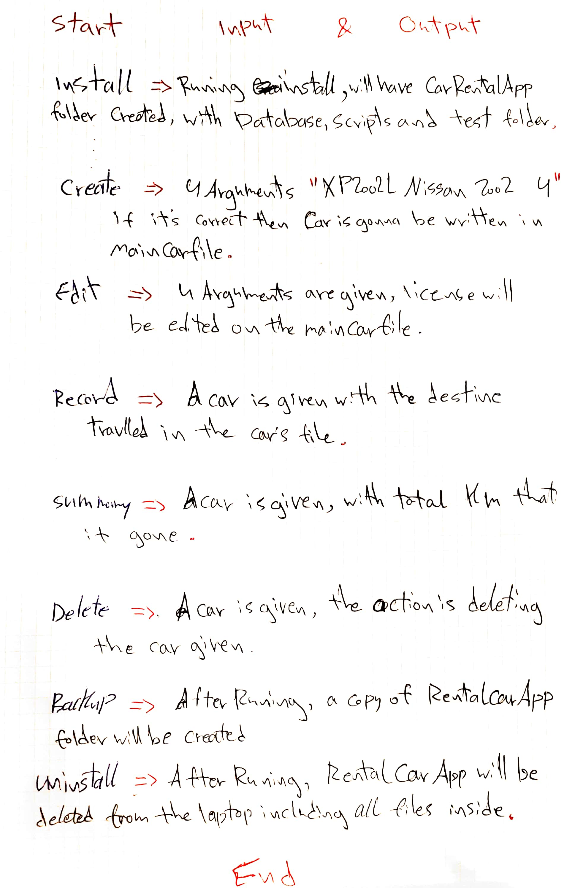

Car Rental Minimal App
===========================

A car rental management minimal app in Bash.

Contents
-----
  1. [Planning](#planning)
  1. [Design](#design)
  1. [Development](#development)
  1. [Evalution](#evaluation)

Planning
----------
### Definition of the problem 
This will be a bash program that records car information for a car rental office. 
Each car will have its own ID number (license Plate) will be saved into TXT file 
Every car will have its own file with its information, and there is going to be a specific file for all cars trips and info, all data will be installed through online links/USB. 
Another TXT file is going to calculate the history of the car (Km/h) and give the total distance that the car passed.
In summary the program will show the name of the car, the total distance with Km, and number of the trips. 
For documentation READ.ME file will be provided and also bash help.
### Solution proposed
so we decided to use a bash program for the solution because the user asks for something easy and simple.
also we're working on the terminal because its already on the computer.
### Success Criteria
1.A car can be created and stored in the database

2.A car information can be edited

3.A car can be deleted

4.The installation is simple 

5.A summery can be generated for a particular car

6.Trips can be recorded and stored for an existing car.

7.A basic backup plan is available.

Solution Overview
---------
### First sketch of system 

**fig. 1** This program shows the main components of the minimal rental app. it includes the Output/Input and actions. 

### Test Planing 

### script for frame 

### flow diagram for creating a frame in bash terminal

**fg. 1**  this program creats a frame in the bash.

```.sh 

#!/bin/bash

word=$1
len=${#word}
padding=4

echo $len

#lenght of the frame
width=80 
(( spaces=$width/2-$len/2-1 )) #didnt got why //
echo $spaces

#Print a whole line with symbol
for (( i=0; i<$width; i++ ))
do
        echo -n "#"
done
	echo " "  #this is for going down one line

#prints the padding
for (( p=1; p<padding ; p++ ))
do
     echo -n "#"   #how the program show spaces without variable
        for (( s=0; s<$width-2; s++ ))
        do
                echo -n " "
        done
        echo "#"
done

#line for the word
	echo -n "#"
for (( s=0; s<$spaces; s++ ))
do
        echo -n " "
done

if [[ $(( $len % 2 )) -ne 0 ]]; then 
	(( spaces=$spaces-1 ))
fi 

echo -n $word
for (( s=0; s<$spaces; s++ ))
do
        echo -n " "
done
echo "#"

#prints the padding
for (( p=1; p<padding ; p++ ))
do
        echo -n "#"
        for (( s=0; s<$width-2; s++ ))
        do
                echo -n " "
        done
        echo "#"
done

#print bottom frame
for (( i=0; i<$width; i++ ))
do
        echo -n "#"
done
	echo " " #this is for going down one line
  ``` 


Development
-----------
### Actions: 1. Create a car
this program creates a new car given four arguments #license #company #model #pessengers
steps: 
1. Check the arguments enered 
2. Create a line inside Database/Maincarfile
3. Create a $licenes.TXT file 

```.sh 
#!/bin/bash

#This program creates a car given four arguments
#License Maker Model Passengers

if [ $# -ne 4 ]; then
	echo "Error with the number of arguments"
	echo "Enter License Maker Model Passengers"
	exit
fi

#number of arguments is correct, continue
license=$1
maker=$2
model=$3
pp=$4

#this creates a new line in the file maincarfile.txt inside CarRentalApp
echo "$license $maker $model $pp" >> ../Database/maincarfile.txt
echo "" > ../Database/$license.txt

bash frame2 "Installation Completed"
```
### 2. Record
records a trip for a car given.
Steps: 
1. check if the arguments are correct 
2. open Database, check if file exists
3. record the km added to the licene provided
```.sh 

!#/bin/bash 

#this program records a trip in the file of a car provided 
if [ $# -ne 2]; then
	echo "error with in the number of arguments"
	echo "enter license distance"

fi
km=$2
license=$1
#check if file exist. using the ! to ask if the file does not exist.
if [ ! -f "$license.txt" ]; then 
	echo "car does not exist"
	exit
fi
echo "$km" >> $licnese.txt 
bash frame3 "trip recorded successfully"

```

### 3. Edit 

Get inputs (license plate)
  Steps:
  1. Check if the arguments are correct 
  2. go to database 
  3. if the license exists then: 
  4. Delete it, and add the new information

Check arguments and Check if car exists  (ONLY ONE) if not one then show a message to user to enter the right argument 

If one then show a message asking what do you want to edit ? (color, name, model, ect..)

Edit the information 

Save new info 

```.sh 

#!/bin/bash
#This program edit the information of an exiting car in the
#maincarfile
#user enters [license place] [model] [red] [pp]

if [ $# -ne 4 ]; then
  echo "Error with the number of arguments"
  echo "Enter License Maker Model Passengers"
  exit
fi

license=$1
maker=$2
model=$3
pp=$4

cd ../Database

if [ ! -f "$license.txt" ]; then
  echo "File not found!"
fi

#find the line with the given car plate and delete it
sed -i '' "/^$license/d" maincarfile.txt
#add the new information
echo "$license $maker $model $pp" >> maincarfile.txt
cd ../scripts
bash frame2 "Car edited successfully"

```
### 4. Delete 

this program delet a car given the licence of the car we want to delete
stepts: 
1. check the arguments 
2. Open Database/Maincarfile
3. Delete the license entered

```.sh 
#!/bin/bash 

#this program delete a car given one argument
#licences 

if [ $# -ne 1 ]; then rm -rf 
	echo "error with the number of arguments"
	echo " enter license"
	exit 
fi 

#number of the arguments is correct, continue 
license=$1

#this delete an existing file maincarfile.txt inside CarRentalApp 
echo "$license" > db/maincarfile.txt

bash frame1 "car deleted successufully"
```

### 5. Backup.sh

A program that creates a backup plan for the database folder
Steps: 
1. Open Desktop
2. Remove any file called Backup 
3. Create file with the name Backup
4. inside Backup, create; Datebase and Scripts 
5. Copy all files from Database and Scripts 
6. Paste in the new file Backup 

```.sh 
#!/bin/bash

# This program creates a backup of the database folder in the app folder
# Either backs up to the desktop, or to an USB stick

# Starting
echo "Backup starting"

##### Save to the desktop
# Navigate to the desktop to create a new folder (backup/)
cd ~/desktop/
# If theres already a folder called "backup", it is removed
rm -r backup
mkdir backup
# Creats subfolder (backup/dataBase/)
cd backup
mkdir dataBase

# Copies all (*) the files from the dataBase folder 
# to the new folder (backup/) and subfolder (backup/dataBase/)
cp ~/desktop/RentalCarApp/dataBase/* ~/desktop/backup/dataBase/

### NOT NECESSARY, ONLY FOR AESTHETIC PURPOSES
# Prints the frame
# Navigates to the folder of the frame.sh script
cd ~/Desktop/RentalCarApp/scripts/
bash frame.sh "Installation complete"


##### Save to a usb stick

: '
echo -n "What is your USB stick called? "
read usbName

cd /Volumes/%usbName/
# If theres already a folder called "backup", it is removed
rm -r backup
mkdir backup
# Creats subfolder (backup/dataBase/)
cd backup
mkdir dataBase

# Copy files to USB stick
cp ~/desktop/RentalCarApp/dataBase/* /Volumes/$usbName/backup/dataBase/

```
### 6. Summary 

summarize the total distance traveled by a car 

```.sh

#!/bin/bash
#This program summarizes the total distance traveled by a car.

total=0

#Read through the car's file
FILE="../Database/$1.txt"
while read line
do
  #Bash splits a line by spaces
  for word in $line
  do
    km=$word
#Calculate the total distance traveled
    (( total=$total + $km ))
    break
  done
done < $FILE

#Print the car's file
echo "Trips:"
cd ../Database/
cat $1.txt

#Print the car's total distance travelled
echo "Total distance travelled:" $total "km"
```

### 7. uninstallation

deleting a created folder for reantal app car 

```.sh 
#!/bin/bash

#this program will delete the created folders for the minimal rental app

echo "Starting to uninstall"
echo "uninstalling in the desktop (default). press enter"
read
cd ~/Desktop

rm -r RentalCarApp


echo "uninstallation complete successfully"

```
### Install
this program install the files required for the app 
1. Go to Desktop 
2. Create a folder RentalCarApp 
3. Open the folder, inside it create Database and Scripts

```.sh 

#!/bash/bin

#This program creatsfile structure for the minimal rental app
echo "start installing"
echo "installing in desktop (default). Press enter"
read
cd ~/Desktop

#create app folder
mkdir RentalCarApp

cd RentalCarApp

mkdir database
mkdir sripts
echo "installation complete successfully"
```
this script meets the requirement of the client for a simple instalation.

Man Pages
----------
Create
```
.TH man 6 "31 Oct 2019" "1.0 " "create man page"
.SH NAME
create \- create a car 
.SH SYNOPSIS
bash create.sh [license] [model] [color] [passenger] 
.SH DESCRIPTION 
create is a script that add the information of the a car into maincarfile and its own information file 
.SH EXAMPLES 
bash create.sh XP2002L Nissan 2002 4 
.SH AUTHOR 
Hasan Ali  
``` 
Record
```
.TH man 6 "1 Nov 2019" "1.0 " "Record man page"
.SH NAME
Record \- Record a car 
.SH SYNOPSIS
bash Record.sh [license] 
.SH DESCRIPTION 
this program records a trip in the database for a car provided
.SH EXAMPLES 
bash Record.sh XP2002L 
.SH AUTHOR 
Hasan Ali 
```
Delete
```
TH man 6 "1 Nov 2019" "1.0 " "Edit man page"
.SH NAME
Edit \- Edit a car
.SH SYNOPSIS
bash Edit.sh [license]
.SH DESCRIPTION
Edit is a script that allows you to edit the information of an existing car
.SH EXAMPLES
bash Edit.sh XP2002L Nissan 2002 4
.SH AUTHOR
Hasan Ali
```
### problem solving

How to detect a word's length is odd or even To detect if the number of characters in a string is odd or even, we must use module (%).

```.sh

(( isEven=$word%2 ))

if [ $isEven -eq 0 ]; then
    echo "This word has an even amount of characters"
fi
How to create an uninstall program To uninstall a folder with contents in bash, you must not only use the rm command, but also add the argument -r. Full command is rm -r Folder
```
how to create a uninstallaion program 
rm -r app 
Evaluation
-----------
Test 1: A car can be created and sorted in the database 
for this purpose we will create the file testCreate.sh. this is called software testing 
# step1 navigate to the folder containing crete.sh file

first step is to check for the file 
```.sh
cd../scripts/
if [ -f "createe.sh" ]; then
        echo "file exists, test wil start now"
else
        echo "file create.sh does not exist. test failed"
fi
```
here the option -f in the if condition checks for a file in the working folder 

this correspnds to dynamic testing and alpha.

